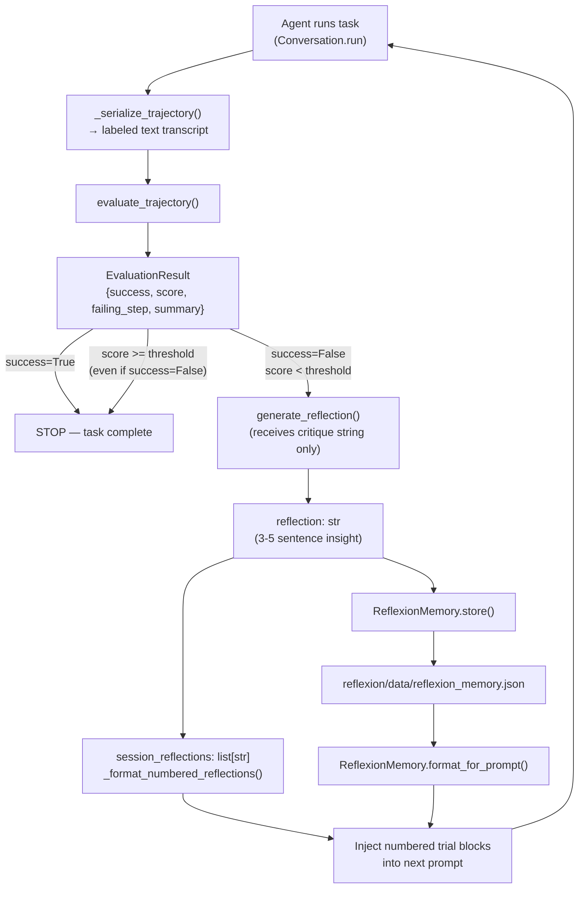
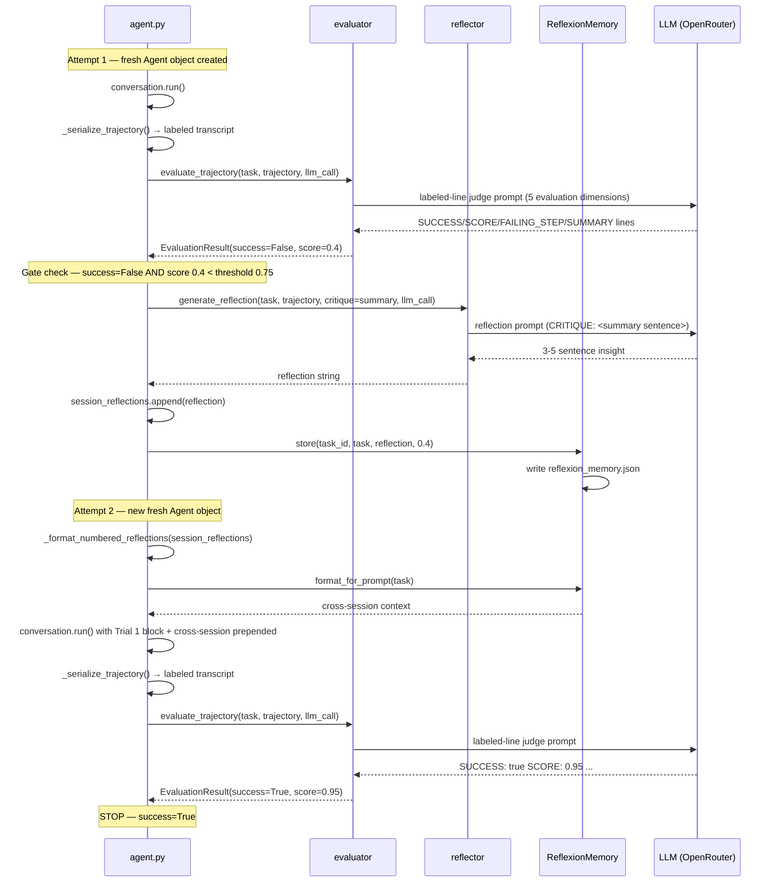

# Reflexion Data Flow

This document describes how data moves through the Reflexion self-improvement
pipeline: what enters, what exits, and how state accumulates across attempts.

## Pipeline Overview



## Stage 1: Evaluate

**Module:** `reflexion/evaluator.py` — `evaluate_trajectory()`

| Input | Type | Source |
|---|---|---|
| `task` | `str` | The original user instruction (e.g. `"Write a Python script..."`) |
| `trajectory` | `str` | `_serialize_trajectory(conversation.state.events)` — a labeled human-readable transcript (see §Trajectory Serialization below) |
| `llm_call` | `callable` | Adapter function: `(system_prompt: str, user_prompt: str) -> str` |

**What happens:**

1. Formats the task and trajectory into a user prompt using `EVALUATOR_USER_TEMPLATE`.
2. Sends `EVALUATOR_SYSTEM_PROMPT` + the user prompt to the LLM. The system prompt includes five calibrated evaluation dimensions (deliverable presence, functional correctness, process soundness, scope completeness, tool usage) and a scoring guide anchored at 0.2 intervals.
3. The LLM returns four labeled plain-text lines: `SUCCESS:`, `SCORE:`, `FAILING_STEP:`, `SUMMARY:`.
4. `_parse_llm_verdict()` extracts each field with its own regex. Missing or malformed fields fall back to conservative per-field defaults — they never collapse the whole response.

| Output | Type | Fields |
|---|---|---|
| `EvaluationResult` | dataclass | `success: bool`, `score: float` (0.0–1.0), `failing_step: Optional[str]`, `summary: str` |

**Parse defaults (per field):**

| Field | Default when missing/unreadable | Rationale |
|---|---|---|
| `SUCCESS` | `False` | Safe: assume failure rather than silently declaring success |
| `SCORE` | `0.5` | Neutral: do not bias the gate toward retrying on a format error |
| `FAILING_STEP` | `None` | No information is better than wrong information |
| `SUMMARY` | Placeholder string | Makes parse failures visible in logs |

**Score gate (stop condition):** After evaluating, `agent.py` applies a dual-signal stop:
1. `evaluation.success is True` → stop immediately.
2. `evaluation.score >= REFLEXION_SCORE_THRESHOLD` → stop even if `success=False` (score escape hatch). This prevents high-quality near-misses from being needlessly retried. Threshold defaults to `0.75`; override via `REFLEXION_SCORE_THRESHOLD` env var.

## Stage 2: Reflect

**Module:** `reflexion/reflector.py` — `generate_reflection()`

| Input | Type | Source |
|---|---|---|
| `task` | `str` | Same original instruction |
| `trajectory` | `str` | Same labeled transcript from Stage 1 |
| `critique` | `str` | `evaluation.summary` — the evaluator's one-sentence verdict (NOT the full `EvaluationResult`) |
| `llm_call` | `callable` | Same adapter function |

**What happens:**

1. Formats a user prompt containing the task, trajectory, and the critique sentence under a `CRITIQUE:` header.
2. Sends `REFLECTOR_SYSTEM_PROMPT` + the user prompt to the LLM.
3. The LLM returns 3–5 sentences of plain-text reflection.

| Output | Type | Description |
|---|---|---|
| `reflection` | `str` | Actionable insight: what went wrong, why, and what to do next time |

**Why only the critique string, not the full `EvaluationResult`?** The reflector should reason about *what went wrong* in plain language, not about numeric scores or binary flags. Passing only `evaluation.summary` keeps the separation of concerns clean: gating decisions (score, success flag) live in `agent.py`; reflection inputs live in `reflector.py`.

The `include_raw_trajectory` flag (default `False`) can prepend the full
transcript for the `LAST_ATTEMPT_AND_REFLEXION` strategy, but we currently
use the pure `REFLEXION` strategy only.

## Stage 2b: In-Session Numbered Reflections

Before storing to persistent memory, `agent.py` also maintains an ordered
in-session list of reflections that is injected into the next attempt's prompt:

```python
session_reflections.append(reflection)
prompt_preamble = _format_numbered_reflections(session_reflections)
```

`_format_numbered_reflections()` produces a block like:

```
The following are reflections from your previous attempts in this session.
Use these lessons to avoid repeating the same mistakes:

--- Trial 1 ---
The agent created the file but forgot to run it.

--- Trial 2 ---
The agent ran the wrong Python version.
```

This numbered format makes the trial sequence legible to the agent and mirrors the
core Reflexion paper mechanism (Shinn et al., 2023). A fresh `Agent` object is
created for every attempt so no internal SDK state leaks between retries.

## Stage 3: Store and Retrieve

**Module:** `reflexion/memory.py` — `ReflexionMemory`

### Store

`memory.store(task_id, task_description, reflection, score)` appends a new
entry and writes the full list to disk.

### JSON Schema

Each entry in `reflexion/data/reflexion_memory.json`:

```json
{
  "task_id": "ae267546-attempt-1",
  "task_description": "Write a Python script that reads a CSV file...",
  "reflection": "The agent spent too much time exploring instead of...",
  "score": 0.2,
  "timestamp": 1711497600.123
}
```

The file is a JSON array of these objects.

### Retrieve

`memory.retrieve(task_description, top_k=3)` scores every stored entry
against the new task using Jaccard similarity on lowercased token sets,
then returns the top-k reflection strings sorted by relevance (ties broken
by recency).

### Prompt Injection

`memory.format_for_prompt(task_description)` calls `retrieve()` and wraps
the results in a header:

```
The following are reflections from your previous attempts.
Use these lessons to avoid repeating the same mistakes:

Reflection 1:
<text>
---
Reflection 2:
<text>
```

This string is prepended to the user instruction before the next agent
attempt, separated by `\n\n---\n\nNow, perform the following task:\n`.

## Data Lifecycle Across Attempts



## File Output Summary

| File | Location | Created By | Gitignored |
|---|---|---|---|
| `reflexion_memory.json` | `reflexion/data/` | `ReflexionMemory._save()` | Yes |

---

## Trajectory Serialization

The trajectory string is produced by `_serialize_trajectory()` in `agent.py`,
which converts SDK event objects into a labeled human-readable transcript:

```
[USER] Create a file called hello.py that prints 'Hello, World!'
[Turn 1] [ACTION] file_editor
  Arguments: command='create', path='/workspace/hello.py', file_text="print('Hello, World!')\n"
[OBSERVATION] file_editor: [File /workspace/hello.py edited with 1 changes.]
[Turn 2] [ACTION] terminal
  Arguments: command='python3 /workspace/hello.py'
[OBSERVATION] terminal: Hello, World!
  ✅ Exit code: 0
```

**Design properties of the serializer:**

- **Pure function:** events in → string out. No side effects.
- **Defensive:** every attribute access uses `getattr` with a default, so an unexpected SDK event type never crashes the loop — it increments an `other` counter and is skipped silently.
- **Dual-attribute checks:** the SDK has evolved (e.g. `action` → `tool_call`, `result` → `observation`), so the serializer checks both names for each event type.
- **Truncation:** observations over 800 characters are truncated with a `[N chars truncated]` note to keep the trajectory readable without losing critical early content.

**Event type detection (duck typing — no SDK class imports needed):**

| Attribute present | Event treated as |
|---|---|
| `role` (non-None) | Message — emitted as `[USER]`, `[ASSISTANT]`, etc. |
| `tool_call` or `action` | Action — emitted as `[Turn N] [ACTION] <tool_name>` |
| `observation` or `result` | Observation — emitted as `[OBSERVATION] <tool_name>: <content>` |
| `error` or `message` | Error — emitted as `[ERROR] <text>` |
| None of the above | Skipped silently, counted as `other` |

**Log line emitted per run:**
```
[trajectory] Serialized N events — message=X action=X observation=X error=X other=X
```

This replaced the previous `str(list(conversation.state.events))` repr dump, which produced Python object notation that was harder for the LLM judge to parse and would silently change format if the SDK renamed its event classes.
