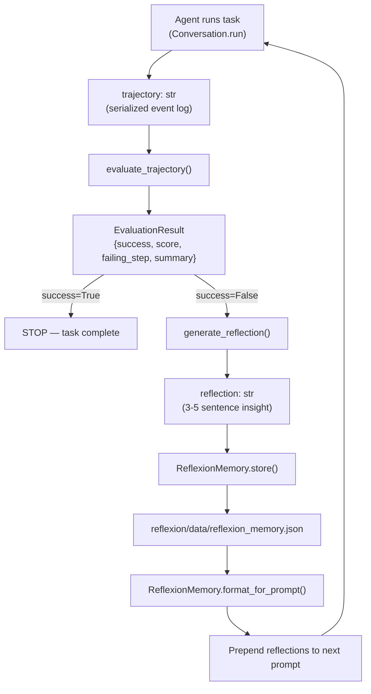
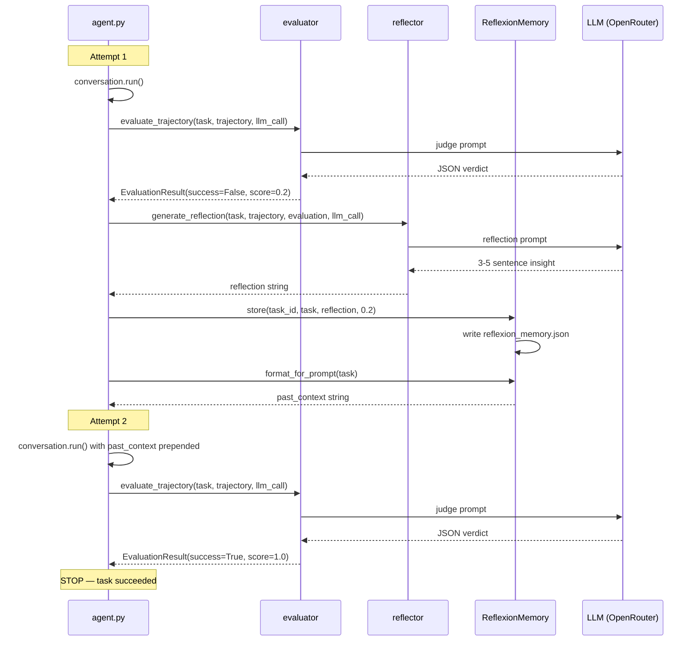

# Reflexion Data Flow

This document describes how data moves through the Reflexion self-improvement
pipeline: what enters, what exits, and how state accumulates across attempts.

## Pipeline Overview



## Stage 1: Evaluate

**Module:** `reflexion/evaluator.py` — `evaluate_trajectory()`

| Input | Type | Source |
|---|---|---|
| `task` | `str` | The original user instruction (e.g. `"Write a Python script..."`) |
| `trajectory` | `str` | `str(list(conversation.state.events))` — the full event log from the SDK |
| `llm_call` | `callable` | Adapter function: `(system_prompt: str, user_prompt: str) -> str` |

**What happens:**

1. Formats the task and trajectory into a user prompt using `EVALUATOR_USER_TEMPLATE`.
2. Sends `EVALUATOR_SYSTEM_PROMPT` + the user prompt to the LLM.
3. The LLM returns a JSON verdict.
4. `_parse_llm_verdict()` parses the JSON into an `EvaluationResult`.

| Output | Type | Fields |
|---|---|---|
| `EvaluationResult` | dataclass | `success: bool`, `score: float` (0.0–1.0), `failing_step: Optional[str]`, `summary: str` |

If the LLM returns malformed JSON, `_parse_llm_verdict` falls back to
`EvaluationResult(success=False, score=0.0, ...)` so the pipeline never crashes.

## Stage 2: Reflect

**Module:** `reflexion/reflector.py` — `generate_reflection()`

| Input | Type | Source |
|---|---|---|
| `task` | `str` | Same original instruction |
| `trajectory` | `str` | Same event log string |
| `evaluation` | `EvaluationResult` | Output from Stage 1 |
| `llm_call` | `callable` | Same adapter function |

**What happens:**

1. Formats a user prompt containing the task, trajectory, and evaluation details.
2. Sends `REFLECTOR_SYSTEM_PROMPT` + the user prompt to the LLM.
3. The LLM returns 3–5 sentences of plain-text reflection.

| Output | Type | Description |
|---|---|---|
| `reflection` | `str` | Actionable insight: what went wrong, why, and what to do next time |

The `include_raw_trajectory` flag (default `False`) can prepend the full
transcript for the `LAST_ATTEMPT_AND_REFLEXION` strategy, but we currently
use the pure `REFLEXION` strategy only.

## Stage 3: Store and Retrieve

**Module:** `reflexion/memory.py` — `ReflexionMemory`

### Store

`memory.store(task_id, task_description, reflection, score)` appends a new
entry and writes the full list to disk.

### JSON Schema

Each entry in `reflexion/data/reflexion_memory.json`:

```json
{
  "task_id": "ae267546-attempt-1",
  "task_description": "Write a Python script that reads a CSV file...",
  "reflection": "The agent spent too much time exploring instead of...",
  "score": 0.2,
  "timestamp": 1711497600.123
}
```

The file is a JSON array of these objects.

### Retrieve

`memory.retrieve(task_description, top_k=3)` scores every stored entry
against the new task using Jaccard similarity on lowercased token sets,
then returns the top-k reflection strings sorted by relevance (ties broken
by recency).

### Prompt Injection

`memory.format_for_prompt(task_description)` calls `retrieve()` and wraps
the results in a header:

```
The following are reflections from your previous attempts.
Use these lessons to avoid repeating the same mistakes:

Reflection 1:
<text>
---
Reflection 2:
<text>
```

This string is prepended to the user instruction before the next agent
attempt, separated by `\n\n---\n\nNow, perform the following task:\n`.

## Data Lifecycle Across Attempts



## File Output Summary

| File | Location | Created By | Gitignored |
|---|---|---|---|
| `reflexion_memory.json` | `reflexion/data/` | `ReflexionMemory._save()` | Yes |

---

## Known Quality Limitation: Trajectory Serialization

The trajectory string passed to the evaluator and reflector is currently
produced by:

```python
trajectory = str(list(conversation.state.events))
```

This generates a **Python repr** of SDK event objects — something like:

```
[MessageEvent(role='user', content=[TextContent(text='Write a Python...')]),
 ActionEvent(tool='BashTool', action=BashAction(command='ls -la')),
 ObservationEvent(result=BashObservation(text='total 0\n...')),
 ...]
```

The LLM judge can parse this because large language models are trained on
Python code and can read object notation, but it is not a natural reading
format. This has two practical consequences:

1. **Evaluation accuracy.** The LLM must infer structure from repr syntax
   rather than reading a clean log. For long, complex trajectories the
   judge may miss subtle signals embedded in nested object fields.

2. **SDK version fragility.** If the SDK changes the repr format of its
   event objects (e.g. renames `TextContent` to `TextBlock`), the
   trajectory string changes format with no warning, and the LLM's ability
   to parse it may degrade silently.

**Recommended future improvement:** Extract a structured transcript before
passing to the Reflexion pipeline:

```python
def serialize_trajectory(events) -> str:
    lines = []
    for event in events:
        if hasattr(event, 'role'):           # message
            lines.append(f"[{event.role.upper()}] {event.content}")
        elif hasattr(event, 'action'):       # tool call
            lines.append(f"[ACTION] {event.action}")
        elif hasattr(event, 'result'):       # observation
            lines.append(f"[OBSERVATION] {event.result}")
    return "\n".join(lines)

trajectory = serialize_trajectory(conversation.state.events)
```

This change is purely in `agent.py` and requires no modification to the
`reflexion/` package — the modules accept any string as the trajectory.
