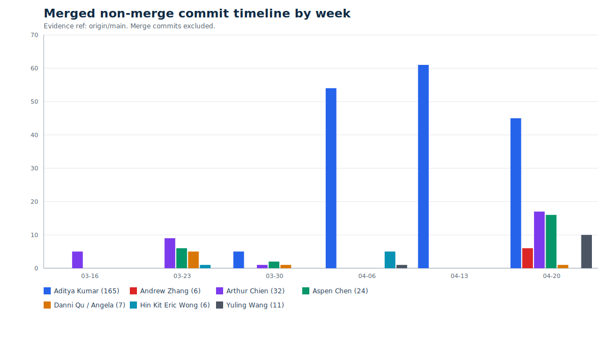

# Non-Technical Contributions

| Area | Contributors |
|---|---|
| Research | Aspen Chen; Aditya Kumar / Sylindril |
| Communications & Project Management | Andrew Zhang |

# Technical Contribution Evidence

Basis: local git history fetched and regenerated through 2026-04-27 23:26:43 EDT (-0400), using `origin/main` only. Unmerged PR branches are excluded. This treats Sylindril as the contributor recorded in git as Aditya Kumar. Merge commits are not counted as implementation work. The primary quantity tables use authored non-merge commits, path-specific numstat, and current-line blame for production source only: cache artifacts, tracked `.json` files, docs/markdown, tests, and test/run fixtures are excluded so data dumps, documentation, and large test artifacts do not inflate product ownership.

Attribution corrections are applied in the reproducible script: commit `86d234a` is counted for Hin Kit Eric Wong, and Aspen-attributed lines under `backend/reflexion_agent` are counted for Hin Kit Eric Wong because later commits clobbered Reflexion attribution. The tables below use those project-level corrections without publishing email addresses or local machine identifiers.

## Summary

No overall rank is asserted here; the feature-level history below shows where the quantities came from. The first technical table is ordered by current blamed production lines; contributor rows in the other summary tables are alphabetical unless the table is explicitly quantity-based.

Main product-path production quantities:

| Contributor | Current blamed lines | Non-merge commits | Lines added | Lines deleted |
|---|---:|---:|---:|---:|
| Aditya Kumar / Sylindril | 10,658 | 156 | 15,362 | 6,189 |
| Aspen Chen | 6,742 | 19 | 7,253 | 373 |
| Arthur Chien | 5,223 | 26 | 6,888 | 1,168 |
| Hin Kit Eric Wong | 2,031 | 13 | 3,003 | 174 |
| Yuling Wang | 553 | 10 | 575 | 61 |
| Danni Qu / Angela | 457 | 5 | 539 | 87 |
| Andrew Zhang | 331 | 5 | 332 | 300 |

Repository-wide commit counts with the `86d234a` attribution correction:

| Contributor | Commits |
|---|---:|
| Aditya Kumar | 165 |
| Andrew Zhang | 14 |
| Arthur Chien | 38 |
| Aspen Chen | 32 |
| Danni Qu / Angela | 8 |
| Hin Kit Eric Wong | 6 |
| Yuling Wang | 11 |

Merged non-merge commit timeline by week:

| Contributor | Total | First | Last | Mar 16 | Mar 23 | Mar 30 | Apr 06 | Apr 13 | Apr 20 | Apr 24-25 |
|---|---:|---|---|---:|---:|---:|---:|---:|---:|---:|
| Aditya Kumar / Sylindril | 165 | 2026-04-05 | 2026-04-25 | 0 | 0 | 5 | 54 | 61 | 45 | 28 |
| Andrew Zhang | 6 | 2026-04-25 | 2026-04-25 | 0 | 0 | 0 | 0 | 0 | 6 | 6 |
| Arthur Chien | 32 | 2026-03-19 | 2026-04-24 | 5 | 9 | 1 | 0 | 0 | 17 | 6 |
| Aspen Chen | 24 | 2026-03-23 | 2026-04-24 | 0 | 6 | 2 | 0 | 0 | 16 | 2 |
| Danni Qu / Angela | 7 | 2026-03-23 | 2026-04-25 | 0 | 5 | 1 | 0 | 0 | 1 | 1 |
| Hin Kit Eric Wong | 6 | 2026-03-28 | 2026-04-10 | 0 | 1 | 0 | 5 | 0 | 0 | 0 |
| Yuling Wang | 11 | 2026-04-06 | 2026-04-25 | 0 | 0 | 0 | 1 | 0 | 10 | 2 |



## Contributor Evidence

**Aditya Kumar / Sylindril.** The merged history attributes the core user journey, employee creation wizard, and application shell to Aditya/Sylindril: router/context/dashboard setup (`c39a01c`, `835fd27`, `dc5a6f5`, `f37a719`), creation wizard route and employee page (`46bebfb`, `692bccb`), initial wizard steps (`8cf83d0`, `f032dd0`, `081115c`), local employee persistence (`664b3db`), backend employee model/schema/API (`510dfbc`, `23ea2cc`, `14bf60e`), and the backend-backed employee migration (`0b234a8`). The wizard's skill and description evolution is also concentrated in Aditya commits: plugin arrays and multi-plugin UI (`e77adeb`, `5a237d3`), radial/list skill graph work (`a0f23d6`, `90ceb5d`, `4fa815f`), reusable skill browser and Learn Skills step (`69f7dc7`, `d11c78e`), model-picker hardening and description flow (`2467882`, `6fb25fc`, `f171847`, `c0247ef`, `6ae6472`, `7c239f9`, `19224fb`), and the System Prompt tab (`ccc0c82`, `fcb11a8`, `2914094`). Current path-specific evidence for wizard/employee/skill UX shows 6,404 added / 1,182 deleted lines over 89 Aditya commits, with 5,140 current blamed Aditya lines.

Adjacent Aditya work covers the merged demo simulator, marketplace, employee-detail workflow, and runtime hardening. Demo simulator commits include event processing (`9cc7044`), macOS-style window/taskbar/root simulator components (`b33dbec`, `754d2a6`, `9812c78`), browser/terminal/editor/notepad scenes (`09315fb`, `05f655f`, `dad57fa`, `5eb3272`), thinking/confidence/report overlays (`b6af9e7`), and mock stream support (`41a8d74`); current merged evidence for these paths shows 1,434 added / 0 deleted lines over 10 Aditya commits, with 1,402 current blamed lines. Marketplace work spans PostgreSQL dependencies, async engine, ORM models, Alembic setup, skill service layer, filesystem seeding, DB-backed skill routers, marketplace browse/search/install APIs, compatibility fallbacks, frontend marketplace tabs/cards/details, submission/review workflows, similar-skill comparison, inline edit/save flows, version history, and cleanup (`08661bc`, `e916393`, `25c1b39`, `4d22b71`, `6ff8e3e`, `22c89b3`, `293db7b`, `ba25b4b`, `a9f973e`, `850109b`, `a0dfa4c`, `25930a4`, `aa1cae2`, `8c66776`, `0235dbd`, `accdc8b`, `5a659fb`, `6544537`, `403480e`, `9d594c7`, `d1c88e3`). Employee-detail and infrastructure work includes scoped employee chat, activity console, report-card wrapper, active-status wiring, shared restore-message utility, crash guards, UUID validation, double-click guards, reusable confirmation dialogs, tab-state reset, skill-card layout fixes, start script, PostgreSQL bootstrapping, WSL line-ending repair, API fallback behavior, env templates/config loading, SQLAlchemy session fixes, path normalization, and path-traversal defenses (`703c9f2`, `9b62293`, `2d1126e`, `ac5004d`, `2b215f2`, `3714d16`, `3585a2f`, `dbd9357`, `c3898bc`, `4021d62`, `edae2f9`, `e2cacd2`, `56ab9d8`, `062359b`, `9d53914`, `d2bbe99`, `2a7e999`, `ab597d8`, `4c524d3`, `0f7974e`, `0174413`, `de59cc7`, `27ca84f`, `cd146b0`, `20e1627`). Across main product paths, the generated evidence table records 10,658 current blamed production lines, 156 non-merge commits, 15,362 added lines, and 6,189 deleted lines for Aditya.

**Arthur Chien.** Arthur contributed the initial repo/chat baseline, early skill-selection UI, agent-facing workflow integration, and workspace sidebar/canvas edit visualization (`8dcdc85`, `2a3a0af`, `91f05f6`, `15e93b9`, `f9099b5`, `ddb1382`, `3e521ab`). Arthur also delivered user-facing product surface around real-time editor PDF/Markdown support, quick-chat relocation to employee pages, SSE filtering, the Project Files subtab, and UI/layout polish (`225a2a9`, `d3a6ed2`, `8d507e5`, `a177a10`, `fed2175`, `9730872`). Additional subsystem evidence shows Arthur as a leading current-line owner for chat interface paths, agent runtime/OpenHands paths, workspace/editor/project-file paths, and the 100% current-blame author of the Project Files tab component. The merged production product-path evidence shows 26 Arthur non-merge commits, 6,888 added / 1,168 deleted lines, and 5,223 current blamed lines after the `86d234a` attribution correction.

**Aspen Chen.** Aspen contributed multimodal skill-ingestion integration, OpenHands integration, Docker workspace integration, browser live view/path selection, persona injection, report cards, metrics/trajectory plumbing, LLM induction, and user ratings (`0a3e53c`, `a11af01`, `6dc8185`, `fb34ff4`, `6472d94`, `7a06bc6`, `0356dd7`, `6678b89`, `365979c`, `98d6a3b`, `488e008`). Additional subsystem evidence shows Aspen as the leading current-line owner for backend API/runtime, employee detail tabs, report/metrics/trajectory, and near-pure browser live view and report UI components. The merged production product-path evidence shows 19 Aspen non-merge commits, 7,253 added / 373 deleted lines, and 6,742 current blamed lines after removing Reflexion-attribution clobbering from Aspen's totals.

**Hin Kit Eric Wong.** Hin Kit Eric Wong is credited with Reflexion implementation work under two explicit project attribution corrections: `86d234a` is counted for Eric, and Aspen-attributed production lines under `backend/reflexion_agent` are counted for Eric. With tests and run artifacts excluded from the primary production table, Reflexion agent paths show 1,736 added / 150 deleted lines over 13 commits credited to Eric, with 1,571 current blamed Eric production lines. The code-focused commits include `86d234a` for the original integration, `f9103c5` for reflexion agent/evaluator/reflector bug and logic fixes, and `fb31357` for step-ceiling and evaluator prompt tuning.

**Andrew Zhang.** Andrew's six merged non-merge commits are late bugfix/infrastructure work: hook-ordering/env cleanup (`8a7632f`), React Compiler/lint fixes (`25766f6`, `dfdb544`, `8502e57`), optional local Postgres startup (`44b07bc`), and pytest dependency coverage (`45010ae`).

**Danni Qu / Angela.** Danni/Angela's seven merged non-merge commits cover skill evaluation UI/API work (`db6cf63`, `45ab6d1`, `df87bcf`, `0f97e06`), SkillsBench import and oversized-task cleanup (`becbc46`, `f41efb1`), and OpenAI base URL config (`83a81a6`).

**Yuling Wang.** Yuling Wang's merged work covers stream termination/final-answer fixes, OpenAI model config and first-run environment fixes, wizard UI bugfixes, LLM similarity checking for skill evaluation, auto skill selection, and selected-skill agent context (`7310ee6`, `88d03f4`, `abe60bb`, `499a796`, `5066069`, `1c31b49`, `65f74d8`, `30039ed`, `78ff9cc`).

## Subsystem Evidence

Focused production subsystem quantities:

| Subsystem | Contributor | Non-merge commits | Lines added | Lines deleted | Current blamed lines |
|---|---|---:|---:|---:|---:|
| Demo simulator | Aditya Kumar / Sylindril | 10 | 1,434 | 0 | 1,402 |
| Demo simulator | Andrew Zhang | 2 | 18 | 32 | 18 |
| Journey / wizard / employee / skill UX | Aditya Kumar / Sylindril | 89 | 6,404 | 1,182 | 5,140 |
| Journey / wizard / employee / skill UX | Andrew Zhang | 3 | 49 | 31 | 48 |
| Journey / wizard / employee / skill UX | Arthur Chien | 10 | 404 | 78 | 368 |
| Journey / wizard / employee / skill UX | Aspen Chen | 7 | 701 | 10 | 693 |
| Journey / wizard / employee / skill UX | Yuling Wang | 3 | 235 | 10 | 233 |
| Reflexion agent | Arthur Chien | 3 | 66 | 4 | 66 |
| Reflexion agent | Hin Kit Eric Wong | 13 | 1,736 | 150 | 1,571 |
| Reflexion agent | Yuling Wang | 3 | 155 | 12 | 154 |

Additional important production subsystem quantities:

Rows below include contributors with at least 100 current blamed production lines in that subsystem. The evidence script prints the complete contributor set, including minor lint/config edits.

| Subsystem | Contributor | Non-merge commits | Lines added | Lines deleted | Current blamed lines |
|---|---|---:|---:|---:|---:|
| Agent runtime / OpenHands | Arthur Chien | 19 | 1,283 | 537 | 1,570 |
| Agent runtime / OpenHands | Aspen Chen | 12 | 1,530 | 131 | 1,522 |
| Agent runtime / OpenHands | Danni Qu / Angela | 3 | 123 | 31 | 105 |
| Agent runtime / OpenHands | Hin Kit Eric Wong | 13 | 2,202 | 81 | 1,394 |
| Agent runtime / OpenHands | Yuling Wang | 7 | 222 | 30 | 204 |
| Backend API / runtime | Aditya Kumar / Sylindril | 39 | 4,243 | 1,581 | 2,700 |
| Backend API / runtime | Arthur Chien | 10 | 1,010 | 243 | 1,439 |
| Backend API / runtime | Aspen Chen | 14 | 3,618 | 141 | 3,631 |
| Backend API / runtime | Danni Qu / Angela | 3 | 123 | 31 | 105 |
| Backend API / runtime | Hin Kit Eric Wong | 13 | 2,208 | 81 | 1,394 |
| Backend API / runtime | Yuling Wang | 7 | 370 | 30 | 352 |
| Chat interface | Aditya Kumar / Sylindril | 16 | 2,190 | 1,707 | 677 |
| Chat interface | Arthur Chien | 15 | 2,342 | 730 | 1,655 |
| Chat interface | Aspen Chen | 9 | 580 | 56 | 473 |
| Employee detail tabs | Aditya Kumar / Sylindril | 18 | 1,337 | 337 | 1,127 |
| Employee detail tabs | Arthur Chien | 10 | 549 | 27 | 364 |
| Employee detail tabs | Aspen Chen | 14 | 2,537 | 175 | 2,380 |
| Report / metrics / trajectory | Aspen Chen | 8 | 4,186 | 158 | 4,027 |
| Skill ingestion / evaluation | Arthur Chien | 16 | 2,207 | 519 | 1,866 |
| Skill ingestion / evaluation | Aspen Chen | 12 | 1,328 | 114 | 1,683 |
| Skill ingestion / evaluation | Danni Qu / Angela | 4 | 485 | 73 | 1,024 |
| Skill ingestion / evaluation | Hin Kit Eric Wong | 1 | 1,547 | 5 | 507 |
| Skill ingestion / evaluation | Yuling Wang | 5 | 225 | 36 | 225 |
| Workspace / editor / project files | Aditya Kumar / Sylindril | 16 | 1,855 | 1,454 | 625 |
| Workspace / editor / project files | Arthur Chien | 11 | 2,547 | 244 | 2,702 |
| Workspace / editor / project files | Aspen Chen | 14 | 2,110 | 113 | 2,130 |
| Workspace / editor / project files | Danni Qu / Angela | 4 | 169 | 37 | 101 |
| Workspace / editor / project files | Hin Kit Eric Wong | 1 | 1,144 | 0 | 460 |
| Workspace / editor / project files | Yuling Wang | 5 | 222 | 13 | 222 |

Pure or near-pure current-blame checks:

| Subsystem signal | Contributor | Current blamed lines | Share | Scope |
|---|---|---:|---:|---|
| Project Files tab component | Arthur Chien | 234 / 234 | 100.0% | `frontend/src/components/employee/EmployeeProjectFilesTab.jsx` |
| Metrics and trajectory backend core | Aspen Chen | 1,630 / 1,630 | 100.0% | `backend/metrics.py`, `backend/trajectory.py`, `backend/trajectory_llm.py`, `backend/prompts` |
| Browser live view component | Aspen Chen | 187 / 192 | 97.4% | `frontend/src/components/BrowserLiveView.jsx` |
| Report UI components | Aspen Chen | 2,224 / 2,250 | 98.8% | report-card, performance, trajectory drawer, trajectory node, and message-rating components |

## Reproduction

Run `bash docs/contribution_report/contribution_evidence.sh` from the repository root to regenerate the headline tables. The script prints its own generation timestamp and defaults to `EVIDENCE_REF=origin/main`, so unmerged PR branches are excluded unless someone explicitly overrides that environment variable. The script applies the attribution corrections for `86d234a` and Reflexion clobbering, and it excludes cache artifacts, JSON, docs/markdown, tests, and test/run fixtures from the primary production quantities. Additional subsystem path arrays are defined in that script so the same command regenerates the backend, agent, chat, workspace, report, skill-ingestion, and employee-tab quantities. Raw path-specific commit lists are omitted by default because the tables and cited commit tags are easier to read; run `INCLUDE_COMMIT_HISTORY=1 bash docs/contribution_report/contribution_evidence.sh` if a full audit trail is needed. The core audit commands are:

```bash
bash docs/contribution_report/contribution_evidence.sh
git log origin/main --no-merges --numstat --format='@@@%H%x09%aN' -- .github/workflows frontend/src backend/routers backend/db backend/services backend/tests backend/alembic start.sh .env.template backend/.env.example backend/server.py backend/reflexion_agent backend/metrics.py backend/trajectory.py backend/trajectory_llm.py backend/config.py.example
git ls-tree -r --name-only origin/main -- .github/workflows frontend/src backend/routers backend/db backend/services backend/tests backend/alembic backend/server.py backend/reflexion_agent backend/metrics.py backend/trajectory.py backend/trajectory_llm.py backend/config.py.example start.sh .env.template backend/.env.example | awk '$0 !~ /(__pycache__\/|[.]pyc$|[.]pyo$|[.]json$|[.]md$|\/docs\/|(^|\/)tests?(\/|$)|(^|\/)test[-_][^\/]*[.](py|sh)$|\/skill-eval-runs\/)/' | xargs -I{} git blame --line-porcelain origin/main -- {}
```

To regenerate the email-ready PDF after editing this markdown, run:

```bash
bash docs/contribution_report/build_pdf.sh
```

That command regenerates `docs/contribution_report/contribution_timeline.svg` from merged `origin/main` history and writes `docs/contribution_report/contribution_report.pdf`. Use `EVIDENCE_REF=main bash docs/contribution_report/build_pdf.sh` if rebuilding from a local branch instead of `origin/main`.

## Post-Fork Technical Contributions

A now-abandoned codebase also contained some technical work.

https://github.com/enoshimakunn/hal-harness

This fork was created from `princeton-pli/hal-harness` on 2026-02-02 18:53 UTC. Counts below use `git blame` only on surviving source-code lines whose blamed commit is fork-only and absent from `princeton-pli/main`. Inherited upstream lines, tests, docs/Markdown, JSON/CSV/TXT data, config/env files, and copied benchmark/vendor snapshots are excluded.

| Contributor | Filtered blamed lines | Technical contribution | Commits |
| --- | ---: | --- | --- |
| Aspen Chen / `enoshimakunn` | 582 | OpenHands SWEBench/BNY agent path, multimodal training pipeline, tool-calling skill updates, and skill-name regularization. | `86e9567`, `a66ffee`, `6818932`, `9dbad82`, `3053b4c` |
| Yuling Wang | 964 | Runner and USACO integration, HAL skill-evaluation framework, embedding-model support, and LLM grading. | `52a33c1`, `fbcf55a`, `14ae8d4` |
| Danni Qu / Angela | 164 | OpenHands SDK agent for USACO evaluation, Docker cleanup, and Weave evaluation changes. | `9bb71c5`, `895a509`, `e3ff835`, `335b776` |
| Arthur Chien | 2,134 | GPT model pricing, financial-agent benchmark, `financial_agent` implementation, and related docs. | `13d4726`, `6b4c394`, `c4d3b5e`, `6b61e56` |
| Aditya Kumar | 1,083 | Slack integration for the core agent, including listener/tool modules and runtime wiring. | `d81edb3` |

Merge-only upstream sync commits after the fork include `74ffec7` and `dda0afc`; they are not counted as direct technical contributions above.
