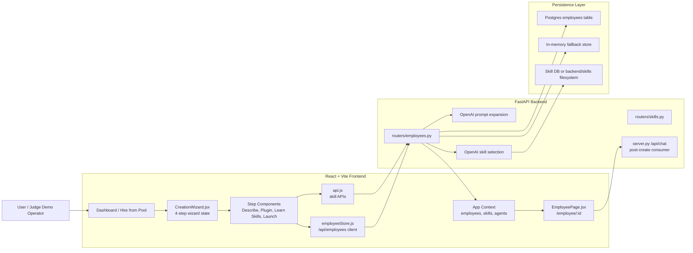
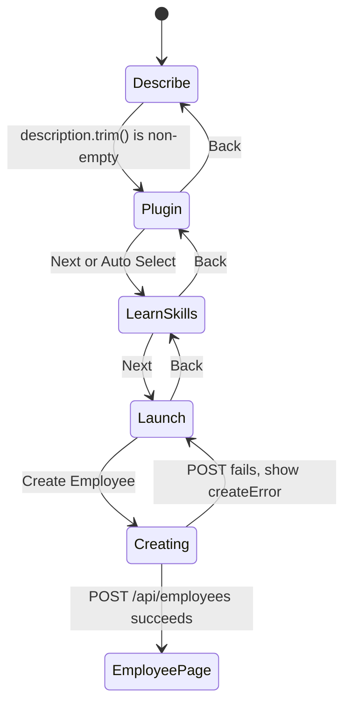
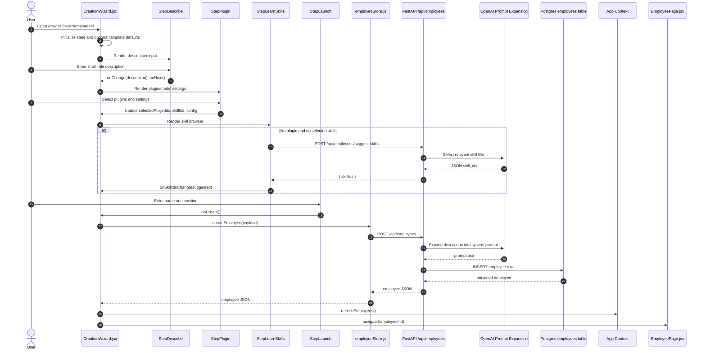
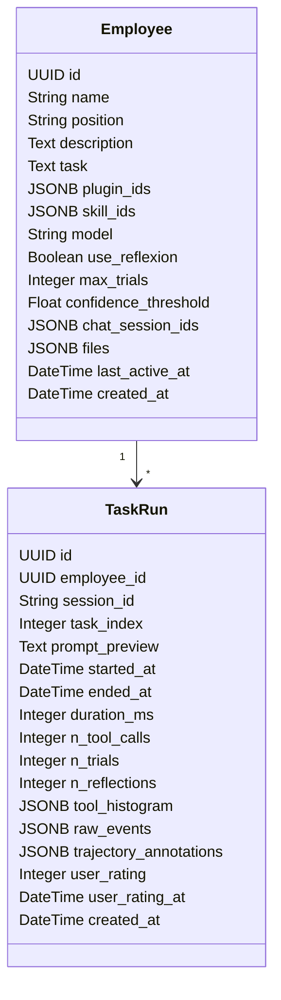
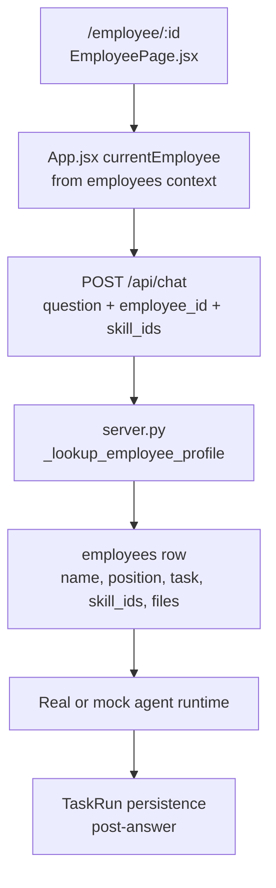
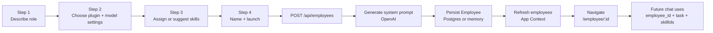

# Employee Creation Wizard Technical Design

This document is the source of truth for a judge-facing technical diagram of
the digital employee creation flow. It focuses only on employee creation and
the immediate handoff into the employee workspace. It is written for a design
team that needs enough implementation detail to draw an accurate high-level
system diagram without reading the whole codebase.

## One-Sentence System Summary

The product lets a user create a persistent AI employee through a 4-step React
wizard, where the frontend collects role intent, plugins, skills, model
settings, and identity fields, then the FastAPI backend expands the short role
description into a full system prompt and persists the employee in Postgres or
an in-memory fallback store.

## Diagram Scope

In scope:

- Creating a new digital employee from `/new`.
- Optional template prefill from `?template=<template_id>`.
- The 4 wizard steps: Describe, Plugin, Learn Skills, Launch.
- Frontend state carried across the wizard.
- Skill suggestion and skill marketplace interactions during creation.
- Backend employee creation and system-prompt generation.
- Employee persistence and navigation to `/employee/:id`.
- The post-create employee object shape that later powers chat.

Out of scope:

- Full chat runtime internals after the employee is already created.
- Report card metrics and task trajectory scoring.
- Skill submission moderation workflows.
- Evaluation lab and benchmark dashboards.
- Live browser, desktop simulator, and canvas internals except where they are
  downstream consumers of the employee profile.

## Primary Source Files

| Area | File | Role |
| --- | --- | --- |
| Dashboard entry point | `frontend/src/pages/DashboardPage.jsx` | Shows employee grid, empty-state create button, create-new button, and template gallery. |
| Template gallery | `frontend/src/components/dashboard/TemplateGallery.jsx` | Navigates users to `/new?template=<template_id>` from "Hire from Pool". |
| Wizard page/state machine | `frontend/src/pages/CreationWizard.jsx` | Owns the 4-step wizard state, template prefill, submit handler, and navigation. |
| Step 1 | `frontend/src/components/wizard/StepDescribe.jsx` | Collects the short employee role description. |
| Step 2 | `frontend/src/components/wizard/StepPlugin.jsx` | Selects plugin bundles, auto-merges plugin skills, and edits model/reflexion settings. |
| Step 3 | `frontend/src/components/wizard/StepLearnSkills.jsx` | Suggests skills when no plugin was chosen and embeds the skill browser. |
| Step 4 | `frontend/src/components/wizard/StepLaunch.jsx` | Collects employee name/position and triggers creation. |
| Plugin catalog | `frontend/src/data/plugins.js` | Static plugin-to-skill bundle definitions. |
| Template catalog | `frontend/src/data/employeeTemplates.js` | Static "Hire from Pool" presets that prefill the wizard. |
| Employee client API | `frontend/src/services/employeeStore.js` | REST calls for `/api/employees`. |
| Shared API client | `frontend/src/services/api.js` | Skill suggestion, skill browsing, chat streaming, and related APIs. |
| Global app context | `frontend/src/App.jsx` and `frontend/src/context/appContextCore.js` | Holds employees, skills, agents, refresh functions, and route-level context. |
| Backend employee router | `backend/routers/employees.py` | Employee CRUD, skill suggestion, prompt generation, metrics endpoints, project files. |
| Backend app | `backend/server.py` | Includes routers, initializes DB availability, later injects employee persona into chat. |
| DB model | `backend/db/models.py` | SQLAlchemy `Employee` and `TaskRun` tables. |
| DB migrations | `backend/alembic/versions/003_add_employees_table.py`, `004_add_employee_position.py`, `009_add_employee_description.py` | Employee table creation and later role/description fields. |
| Runtime config | `backend/config.py.example`, `.env.template` | `OPENAI_API_KEY`, `DATABASE_URL`, `AGENT_MODEL`, and skill-selection model settings. |

## High-Level Architecture



## 4-Step Wizard Flow

The wizard is implemented as a single React page with a numeric `step` state.
The page renders exactly one step component at a time and keeps all wizard data
in parent state so earlier choices are still available at launch.

`CreationWizard.jsx` defines:

```js
const STEPS = ["Describe", "Plugin", "Learn Skills", "Launch"];
```

Core wizard state:

| State | Type | Initialized From | Purpose |
| --- | --- | --- | --- |
| `step` | number | `0` | Current wizard screen index. |
| `description` | string | `""` | Short natural-language role hint from the user. |
| `selectedPluginIds` | string[] | Template plugin IDs or `[]` | Selected plugin bundles. |
| `skillIds` | string[] | Template plugin skill union or `[]` | Skills assigned to the employee. |
| `config.model` | string | First template plugin default model or `""` | Model preference for prompt generation and later chat. |
| `config.maxTrials` | number | `3` | Reflexion trial ceiling for later chat. |
| `config.confidenceThreshold` | number | `0.7` | Reflexion confidence threshold for later chat. |
| `config.useReflexion` | boolean | `false` | Whether later chat turns use Reflexion. |
| `name` | string | Template `suggestedName` or `""` | Human-facing employee name. |
| `position` | string | Template display name or `""` | Job title/role label. |
| `creating` | boolean | `false` | Submit-in-progress guard for the Launch button. |
| `createError` | string/null | `null` | User-facing create failure message. |

### Wizard State Machine



### Step 1: Describe

Component: `frontend/src/components/wizard/StepDescribe.jsx`

User-facing question:

- "What do you need your digital employee to do?"

Data collected:

- `description`

Validation:

- The "Next" button is disabled until `description.trim()` is non-empty.

Important behavior:

- The description is intentionally short. It is not the final system prompt.
- The backend expands this short description into the full employee `task`
  field during creation.
- The short text is still stored as `Employee.description` for traceability and
  later editing in the System Prompt tab.

Diagram callout:

- Label this as "Human intent capture".
- It is the only required input before moving through the wizard.

### Step 2: Plugin

Component: `frontend/src/components/wizard/StepPlugin.jsx`

Data collected or mutated:

- `selectedPluginIds`
- `skillIds`
- `config.model`
- `config.useReflexion`
- `config.maxTrials`
- `config.confidenceThreshold`

Plugin catalog:

- Source: `frontend/src/data/plugins.js`
- Plugins are static frontend objects with:
  - `id`
  - `name`
  - `description`
  - `bestFor`
  - `icon`
  - `skillIds`
  - `defaultModel`

Current plugin bundles:

| Plugin ID | Name | Bundled Skill IDs | Default Model |
| --- | --- | --- | --- |
| `research-analyst` | Research Analyst | `web-search`, `edgar-search`, `parse-html`, `retrieve-info` | `anthropic/claude-sonnet-4-5-20250929` |
| `data-engineer` | Data Engineer | `parse-html`, `retrieve-info` | `openai/gpt-4o` |
| `compliance-reviewer` | Compliance Reviewer | `retrieve-info`, `web-search` | `anthropic/claude-sonnet-4-5-20250929` |
| `report-writer` | Report Writer | `retrieve-info` | `openai/gpt-4o` |
| `general-assistant` | General Assistant | none | `openai/gpt-4o` |

Plugin toggle behavior:

1. User clicks a plugin card.
2. `handlePluginToggle(plugin)` adds or removes the plugin ID.
3. The wizard recomputes `skillIds` as the unique union of all skills bundled
   by currently selected plugins.
4. If the plugin was newly selected, `config.model` is set to that plugin's
   `defaultModel`.

Advanced model/settings behavior:

- The advanced section is collapsed by default.
- Model suggestions are built from curated defaults plus models already used
  by known agents from `useApp().agents`.
- The model input is currently a `<select>`, not a free-form text input.
- Reflexion settings are saved on the employee record but affect later chat
  behavior, not employee creation itself.

Skill editor behavior inside this step:

- Only appears after at least one plugin is selected.
- Can show either list view or graph view.
- List view lets users remove bundled skills, add available skills from
  `allSkills`, or type a custom skill ID/name.
- Graph view uses `SkillGraph.jsx`, showing selected skills and suggested cloud
  skills.

Diagram callout:

- Label this step as "Role package and execution settings".
- The plugin is not stored as the employee's actual capability by itself; it is
  stored as metadata and used to derive `skillIds`.

### Step 3: Learn Skills

Component: `frontend/src/components/wizard/StepLearnSkills.jsx`

Data collected or mutated:

- `skillIds`

Main embedded component:

- `frontend/src/components/skills/SkillBrowser.jsx`

Automatic skill suggestion:

- Triggered only when all of these are true:
  - No plugin has been selected: `pluginIds.length === 0`
  - No skills are already selected: `skillIds.length === 0`
  - The description is non-empty: `description.trim()`
  - Suggestions have not already run for this step mount: `!hasSuggested`

Frontend API call:

```http
POST /api/employees/suggest-skills
Content-Type: application/json

{
  "description": "SEC filings expert for AAPL, focus on revenue trends"
}
```

Expected response:

```json
{
  "skillIds": ["web-search", "edgar-search", "retrieve-info"]
}
```

Backend implementation:

- Route: `backend/routers/employees.py`, `suggest_skills`.
- Helper: `_auto_select_skills(description)`.
- Candidate skills are loaded from:
  - Database-backed skills through `services.skill_service.list_skills`, when
    DB is available.
  - In-memory filesystem-loaded skills from `server._SKILLS`, when DB is not
    available.
- The LLM selection model is `SKILL_SELECTION_MODEL` from `backend/config.py`
  or `.env`.
- If `OPENAI_API_KEY` is missing or the model call fails, skill suggestion
  returns an empty list rather than failing the wizard.

Manual skill behavior:

- User can browse existing skills.
- User can create a skill manually.
- User can train a skill from media.
- Newly created or trained skills are selected into `skillIds` and cause
  `refreshSkills()` to update global context.

Important implementation detail:

- Skill IDs are not fully validated at employee creation time.
- Runtime validation occurs when `/api/chat` receives `skill_ids` and calls
  `_validate_skills_for_runtime`.
- This allows custom manually typed IDs to be stored, but an unknown ID can
  fail later when the employee is used.

Diagram callout:

- Label this step as "Capability selection".
- Show two skill sources: "manual marketplace/browser" and "LLM auto-suggest".

### Step 4: Launch

Component: `frontend/src/components/wizard/StepLaunch.jsx`

Data collected:

- `name`
- `position`

Review data shown:

- Position or plugin names or "Custom".
- Model suffix from `config.model`.
- Original description.
- Selected skills.
- Reflexion configuration if enabled.

Validation:

- The "Create Employee" button is disabled until `name.trim()` is non-empty.
- `position` can be empty.

Submit behavior:

- `onCreate` calls `handleCreate()` in `CreationWizard.jsx`.
- Duplicate clicks are guarded by `creating`.
- Button label changes to "Writing system prompt..." while awaiting the
  backend.

Frontend create payload:

```js
await createEmployee({
  name: name.trim(),
  position: position.trim(),
  description,
  pluginIds: selectedPluginIds,
  skillIds,
  model: config.model || undefined,
  useReflexion: config.useReflexion,
  maxTrials: config.maxTrials,
  confidenceThreshold: config.confidenceThreshold,
});
```

On success:

1. Backend returns the created employee object.
2. `refreshEmployees()` reloads the global employee list.
3. The frontend navigates to `/employee/${emp.id}`.

On failure:

1. `creating` is reset to `false`.
2. The error message is displayed under the summary card.

Diagram callout:

- Label this step as "Identity and persistence".
- The user-facing "Create Employee" action is also where prompt generation
  happens.

## Template Prefill Flow

Templates are optional entry points from the dashboard's "Hire from Pool"
experience.

Template source:

- `frontend/src/data/employeeTemplates.js`

Template fields:

| Field | Meaning |
| --- | --- |
| `id` | URL query value for `?template=<id>`. |
| `name` | Template display name and default employee `position`. |
| `description` | Template card description. It does not currently prefill the wizard description. |
| `pluginIds` | Plugins initially selected in the wizard. |
| `suggestedName` | Default employee `name`. |
| `avatar` | Lucide icon key for template card visuals. |

Template initialization in `CreationWizard.jsx`:

- Reads `templateId` from `useSearchParams()`.
- Finds the template in `EMPLOYEE_TEMPLATES`.
- Derives `templatePlugins` from `PLUGINS`.
- Prefills:
  - `selectedPluginIds` from `template.pluginIds`.
  - `skillIds` as the union of selected template plugin skills.
  - `config.model` from the first template plugin's default model.
  - `name` from `template.suggestedName`.
  - `position` from `template.name`.

Notable behavior:

- Template `description` is not currently assigned to wizard `description`.
- Therefore, even template-based creation still requires the user to type a
  description in Step 1 before continuing.

## Employee Creation Sequence



## Frontend API Boundary

Employee CRUD client:

- File: `frontend/src/services/employeeStore.js`
- Base path: `/api/employees`

Functions used in creation:

| Function | HTTP Call | Used By |
| --- | --- | --- |
| `createEmployee(payload)` | `POST /api/employees` | Launch step submit through `CreationWizard.jsx`. |
| `getEmployees()` | `GET /api/employees` | App context refresh after creation. |
| `getEmployeeById(id)` | `GET /api/employees/:id` | Employee page loading after navigation. |

Create request body from frontend:

```json
{
  "name": "Sarah",
  "position": "Equity Research Analyst",
  "description": "SEC filings expert for AAPL, focus on revenue trends",
  "pluginIds": ["research-analyst"],
  "skillIds": ["web-search", "edgar-search", "parse-html", "retrieve-info"],
  "model": "anthropic/claude-sonnet-4-5-20250929",
  "useReflexion": false,
  "maxTrials": 3,
  "confidenceThreshold": 0.7
}
```

Create response body:

```json
{
  "id": "uuid",
  "name": "Sarah",
  "position": "Equity Research Analyst",
  "description": "SEC filings expert for AAPL, focus on revenue trends",
  "task": "Expanded multi-paragraph system prompt generated by the backend.",
  "pluginIds": ["research-analyst"],
  "skillIds": ["web-search", "edgar-search", "parse-html", "retrieve-info"],
  "model": "anthropic/claude-sonnet-4-5-20250929",
  "useReflexion": false,
  "maxTrials": 3,
  "confidenceThreshold": 0.7,
  "status": "idle",
  "chatSessionIds": [],
  "files": [],
  "lastActiveAt": null,
  "createdAt": "2026-04-27T21:00:00+00:00"
}
```

Important casing detail:

- Frontend and API JSON use camelCase fields such as `pluginIds`,
  `skillIds`, `useReflexion`, `maxTrials`, and `confidenceThreshold`.
- SQLAlchemy and Postgres use snake_case columns such as `plugin_ids`,
  `skill_ids`, `use_reflexion`, `max_trials`, and `confidence_threshold`.
- `routers/employees.py` handles this mapping explicitly in `_row_to_dict`
  and the create/update route bodies.

## Backend Create Path

Route:

```http
POST /api/employees
```

Implementation:

- File: `backend/routers/employees.py`
- Pydantic model: `EmployeeCreate`
- Route handler: `create_employee(body: EmployeeCreate)`

`EmployeeCreate` fields:

| Field | Type | Default | Validation / Meaning |
| --- | --- | --- | --- |
| `name` | string | required | Employee display name. UI caps this at 40 chars. DB uses `String(40)`. |
| `position` | string | `""` | Job title/role. UI caps this at 120 chars. DB uses `String(120)`. |
| `description` | string | `""` | Short wizard hint. Pydantic max length: 2000 chars. |
| `task` | string | `""` | Full system prompt. Pydantic max length: 40000 chars. Usually generated by backend. |
| `pluginIds` | string[] | `[]` | Selected plugin metadata. |
| `skillIds` | string[] | `[]` | Assigned skill IDs. |
| `model` | string | `""` | User-facing model preference. |
| `useReflexion` | boolean | `false` | Later chat setting. |
| `maxTrials` | integer | `3` | Later chat setting. |
| `confidenceThreshold` | float | `0.7` | Later chat setting. |
| `files` | object[] | `[]` | Starts empty during wizard creation. Project Files tab can add later. |

Create algorithm:

1. Read `description` and `task` from the request.
2. If `description.strip()` is non-empty and `task.strip()` is empty, call
   `_generate_system_prompt(description, body.model)`.
3. If DB is available, insert a SQLAlchemy `Employee` row.
4. If DB is unavailable, append a dict to `_memory_store`.
5. Return a normalized employee JSON object.

System prompt generation:

- Helper: `_generate_system_prompt(description, model)`.
- Requires `OPENAI_API_KEY`.
- Calls OpenAI chat completions using a meta prompt stored in
  `_SYSTEM_PROMPT_META`.
- The selected model is passed through `_resolve_openai_model(model)`:
  - `openai/gpt-4o` becomes `gpt-4o`.
  - Bare OpenAI model IDs are used as-is.
  - Non-OpenAI provider IDs fall back to `_FALLBACK_PROMPT_MODEL`.
  - Empty model IDs also fall back to `_FALLBACK_PROMPT_MODEL`.
- Fallback prompt model: `gpt-4o-mini`.
- Timeout: 30 seconds.
- Max tokens: 1500.
- Temperature: 0.4.
- If the OpenAI key is missing or generation fails, the route returns HTTP 503
  and the frontend shows the error on the Launch step.

Why generation happens server-side:

- The backend owns prompt expansion so the user only needs to provide a short
  intent.
- The client intentionally does not send `task` during normal creation.
- The created employee always stores both:
  - `description`: original short user hint.
  - `task`: generated full system prompt used by chat.

## Persistence Model

SQLAlchemy model:

- File: `backend/db/models.py`
- Class: `Employee`
- Table: `employees`

Postgres table shape:



Creation-related columns:

| Column | Set During Creation | Meaning |
| --- | --- | --- |
| `id` | Yes, DB generated or UUID in memory | Stable employee ID used by `/employee/:id`. |
| `name` | Yes | Human-readable employee name. |
| `position` | Yes | Role/title shown on employee page and used in persona. |
| `description` | Yes | Original short wizard description. |
| `task` | Yes | Generated full system prompt. |
| `plugin_ids` | Yes | Plugin metadata selected in the wizard. |
| `skill_ids` | Yes | Assigned skills that later get materialized for chat. |
| `model` | Yes | Model preference selected or defaulted by plugins. |
| `use_reflexion` | Yes | Later chat setting. |
| `max_trials` | Yes | Later chat setting. |
| `confidence_threshold` | Yes | Later chat setting. |
| `chat_session_ids` | Defaults to empty | Populated only after employee chats start. |
| `files` | Defaults to empty | Populated later by Project Files tab. |
| `last_active_at` | Null initially | Updated during chat via `markActive`. |
| `created_at` | Yes | Creation timestamp. |

DB availability:

- `backend/server.py` checks `DATABASE_URL` during FastAPI lifespan startup.
- If `DATABASE_URL` is configured, Alembic migrations run and skills are seeded.
- `routers.employees.set_db_available(True)` enables Postgres-backed employee
  CRUD.
- If DB setup fails or `DATABASE_URL` is empty, employees are stored in
  `routers/employees.py` module-level `_memory_store`.

In-memory fallback:

- Useful for demos and local development without Postgres.
- Employee data is lost when the backend process restarts.
- API shape remains the same so the frontend does not need a different path.

## Post-Create Handoff

After successful creation:

1. `CreationWizard.jsx` calls `refreshEmployees()`.
2. `App.jsx` reloads `employees` by calling `getEmployees()`.
3. The router navigates to `/employee/:id`.
4. `EmployeePage.jsx` fetches the employee by ID.
5. The employee page shows tabs:
   - Chat
   - Skills
   - Project Files
   - System Prompt
   - Report Card

How the employee profile later affects chat:

- `App.jsx` derives `currentEmployeeId` from the `/employee/:id` route.
- `currentEmployee` is looked up from the global employee list.
- Chat requests include:
  - `employee_id`
  - `employee.name`
  - `employee.position`
  - `employee.task`
  - `skill_ids`
  - `model`
  - Reflexion settings
- `backend/server.py` prefers server-side lookup by `employee_id` so stale
  browser copies do not override persisted employee data.
- The backend falls back to the client-supplied `employee` payload if DB lookup
  is unavailable.

This matters for the diagram because employee creation is not just a card in
the UI. It creates the persisted persona object that the chat endpoint later
uses as the agent's identity and standing instruction.

## Post-Create Chat Persona Flow



## Error and Edge Case Behavior

Prompt generation key missing:

- Normal wizard creation sends `description` and no `task`.
- Because Step 1 requires `description`, the backend will try to generate a
  system prompt.
- If `OPENAI_API_KEY` is missing, `POST /api/employees` returns HTTP 503.
- The Launch step shows the backend error and keeps the user on the step.

Skill suggestion key missing:

- `POST /api/employees/suggest-skills` does not fail the wizard when the key
  is missing.
- The backend logs a warning and returns `{"skillIds": []}`.

No plugin selected:

- Step 2 button says "Auto Select".
- Step 3 attempts automatic skill suggestion if description and empty skills
  are present.
- User can still proceed with zero skills selected.

No model selected:

- If no plugin was selected and the user does not open model settings,
  `config.model` can remain empty.
- The frontend omits `model` from JSON when it is empty.
- Backend `EmployeeCreate.model` defaults to an empty string.
- Prompt generation resolves an empty model to `gpt-4o-mini`.
- Later chat calls pass `employee.model || undefined`, so the chat agent falls
  back to the backend default agent model.

Custom or unknown skill IDs:

- The wizard can store custom typed skill IDs.
- Runtime skill validation happens later during chat.
- Unknown skill IDs can cause `/api/chat` to return HTTP 400 with
  `Unknown skill_id: <id>`.

Template description:

- Template descriptions describe the template card.
- They do not prefill Step 1's `description` state today.
- A user must still type a task/role description.

Database unavailable:

- Employee creation still works through `_memory_store`.
- Data does not survive backend restart.
- Returned JSON shape is intended to match the DB-backed path.

## Diagram-Ready Narrative

Use this copy as the core explanation for judges:

1. The user starts from the dashboard and opens a 4-step wizard to define a
   digital employee.
2. Step 1 captures plain-English role intent. This is intentionally short so
   the user does not have to write a system prompt.
3. Step 2 lets the user choose a plugin bundle. A plugin is a role package that
   maps to a curated set of skills and default model settings.
4. Step 3 assigns skills. If no plugin was chosen, the backend can use an LLM
   to match the role description against available skills.
5. Step 4 names the employee and submits the configuration.
6. The backend expands the short description into a full system prompt and
   persists the employee profile.
7. The frontend refreshes its employee list and opens the new employee page.
8. Future chat turns use the persisted employee ID to recover the employee's
   name, role, system prompt, files, and skills server-side.

## Recommended Judge-Facing Diagram Layout

Recommended visual structure:

- Left lane: "User Journey"
  - Dashboard
  - 4-step wizard
  - Employee page
- Middle lane: "Frontend State"
  - `CreationWizard.jsx`
  - parent-held wizard state
  - `employeeStore.js`
  - `AppContext.refreshEmployees`
- Right lane: "Backend + Persistence"
  - `POST /api/employees/suggest-skills`
  - `POST /api/employees`
  - OpenAI prompt expansion
  - Postgres `employees`
  - memory fallback
- Bottom lane: "Post-create runtime"
  - `/employee/:id`
  - `/api/chat`
  - server-side employee lookup

Make these high-level labels prominent:

- "Intent"
- "Plugin Bundle"
- "Skills"
- "Identity"
- "Generated System Prompt"
- "Persistent Employee Profile"
- "Chat Persona"

Avoid overloading the diagram with:

- Individual React hooks.
- Every skill marketplace modal.
- Full task-run metrics.
- OpenHands workspace internals.
- Alembic revision details.

## Field Mapping Cheat Sheet

| Concept | Frontend State | API JSON | Backend Pydantic | DB Column |
| --- | --- | --- | --- | --- |
| Employee name | `name` | `name` | `EmployeeCreate.name` | `employees.name` |
| Role title | `position` | `position` | `EmployeeCreate.position` | `employees.position` |
| User hint | `description` | `description` | `EmployeeCreate.description` | `employees.description` |
| System prompt | not normally set | `task` omitted | generated into `task` | `employees.task` |
| Plugins | `selectedPluginIds` | `pluginIds` | `EmployeeCreate.pluginIds` | `employees.plugin_ids` |
| Skills | `skillIds` | `skillIds` | `EmployeeCreate.skillIds` | `employees.skill_ids` |
| Model | `config.model` | `model` | `EmployeeCreate.model` | `employees.model` |
| Reflexion toggle | `config.useReflexion` | `useReflexion` | `EmployeeCreate.useReflexion` | `employees.use_reflexion` |
| Trial count | `config.maxTrials` | `maxTrials` | `EmployeeCreate.maxTrials` | `employees.max_trials` |
| Confidence threshold | `config.confidenceThreshold` | `confidenceThreshold` | `EmployeeCreate.confidenceThreshold` | `employees.confidence_threshold` |
| Chat ownership | created later | `chatSessionIds` | `EmployeeUpdate.chatSessionIds` | `employees.chat_session_ids` |
| Project files | created later | `files` | `EmployeeCreate.files` | `employees.files` |

## Endpoint Summary

| Method | Endpoint | Used During Creation | Purpose |
| --- | --- | --- | --- |
| `GET` | `/api/employees` | Yes, after create | Refresh global employees list. |
| `GET` | `/api/employees/:id` | Yes, after navigation | Load employee page. |
| `POST` | `/api/employees` | Yes | Create employee and generate prompt. |
| `PATCH` | `/api/employees/:id` | Not in wizard | Later updates to skills, prompt, files, active time. |
| `DELETE` | `/api/employees/:id` | Not in wizard | Delete employee. |
| `POST` | `/api/employees/suggest-skills` | Maybe | Auto-select skills when no plugin was chosen. |
| `GET` | `/api/skills` | Yes | Populate skill browser and candidate skill list. |
| `POST` | `/api/skills` | Maybe | Create a manual skill from the skill browser. |
| `POST` | `/api/skills/train` | Maybe | Train skills from media. |
| `POST` | `/api/chat` | Post-create | Use employee persona and skills in conversation. |

## Important Environment Variables

| Variable | Required For | Behavior If Missing |
| --- | --- | --- |
| `OPENAI_API_KEY` | Prompt generation and skill suggestion | Employee creation with a description fails at prompt generation; skill suggestion returns empty list. |
| `DATABASE_URL` | Persistent employees and skills | Backend falls back to in-memory stores. |
| `SKILL_SELECTION_MODEL` | Automatic skill selection | Defaults to `openai/gpt-4o` in config. |
| `AGENT_MODEL` | Later chat runtime display/runtime model | Defaults to `openai/gpt-5.4` in config. |

## Current Implementation Constraints

- The wizard is not a form library or route-per-step flow; it is a React state
  machine inside one page.
- Plugins are frontend-static definitions, not backend rows.
- Skill suggestions are backend-dynamic because they need current skill
  candidates and an LLM call.
- Prompt generation is synchronous inside `POST /api/employees`; the user waits
  on the Launch step until the system prompt is written.
- Employee creation persists configuration and persona, but does not create a
  chat session. Chat sessions are linked only when the user starts chatting.
- The backend stores employee files metadata in `employees.files`, but the
  creation wizard starts this field empty.

## Minimal Data Flow for a Single Diagram

If the diagram needs to be compact, show this flow:



## Confidence Notes

This document is based on the current implementation in the repository as of
April 27, 2026. It describes observed code behavior, including fallback paths
and edge cases, rather than an idealized product design.
